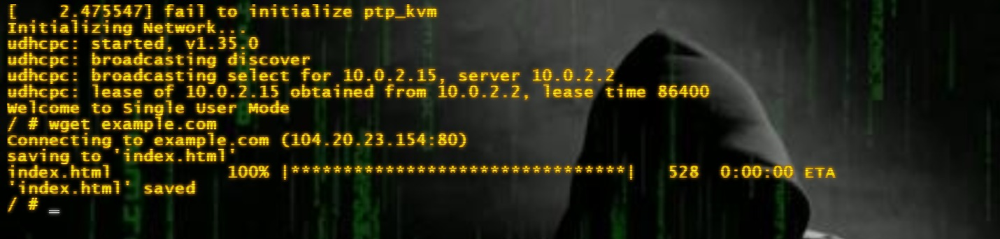

 # SISOP-5-2026-IT-083

  ## Profil Mahasiswa
  Nama           : D'Qhaizhar Ari Dhiaulhaq

  NRP            : 5027251083

  Departemen     : Teknologi Informasi

  ## Laporan Penyelesaian Soal Praktikum Modul 5
  Repository ini berisi source code dan penjelasan mengenai penyelesaian soal Praktikum Modul 5 untuk mata kuliah Sistem Operasi. Modul ini berfokus pada
  Operating System & Bootloaders, termasuk kompilasi Kernel Linux secara kustom dan pembuatan sistem file (initramfs) menggunakan BusyBox.

  ## Problem Keseluruhan
  Dalam penyelesaian modul ini, saya menggunakan bantuan Gemini AI sebagai partner diskusi utama untuk memecahkan masalah teknis terkait kernel panic,
  manajemen symlink pada initramfs, dan konfigurasi jaringan pada emulator QEMU. Bantuan AI sangat krusial dalam mendiagnosa pesan error kernel yang cukup
  kompleks.

  Gemini AI : Link Percakapan [Link](https://gemini.google.com/share/7f92166df750)

  ## Soal 1
  Pada soal ini, saya menggunakan berbagai perintah dasar dan lanjut seperti make, cpio, wget, fakeroot, sed, dos2unix, dan qemu-system-x86_64.

  ### Problem Soal 1
  Pada penyelesaian soal 1, saya menghadapi beberapa masalah kritis:
   1. Kernel Panic: Muncul pesan Kernel panic - not syncing: No working init found karena BusyBox menginstal symlink dengan absolute path yang merujuk ke
      folder host, sehingga tidak ditemukan saat booting di dalam QEMU.
   2. TTY Access: Pesan /bin/sh: can't access tty; job control turned off yang menyebabkan shell tidak stabil.
   3. Network Unreachable: Perintah ping dan wget gagal karena absennya default script untuk udhcpc, sehingga IP dan DNS tidak terkonfigurasi secara
      otomatis meski lease sudah didapatkan.
   4. Package Manager Gagal: Link download apk-tools yang diberikan sudah tidak aktif (404 Not Found).

  ### Penyelesaian Soal 1

  1. Kompilasi Kernel (kernel.sh)
  Pertama, saya mengunduh source code Linux Kernel 6.1.1 dan melakukan konfigurasi menggunakan make defconfig. Saya mengubah nama kernel menggunakan sed
  pada Makefile untuk menambahkan identitas -farewell (Poin 2).
```bash
   1 # Potongan kode modifikasi Makefile
   2 sed -i 's/^EXTRAVERSION =.*/EXTRAVERSION = -farewell/' Makefile
```

  2. Pembuatan Filesystem Single-User (single.sh)
  Saya membuat struktur direktori dasar dan mengunduh BusyBox statis. Untuk mengatasi Kernel Panic, saya menambahkan logika untuk mengubah semua absolute
  symlink menjadi relative symlink.

```bash
   1 # Solusi agar init ditemukan (Relative Symlink)
   2 for link in bin/*; do
   3     if [ -L "$link" ]; then
   4         ln -sf busybox "$link"
   5     fi
   6 done
```

  3. Konfigurasi Jaringan & Init Script
  Untuk mengatasi masalah jaringan, saya membuat file /usr/share/udhcpc/default.script yang berfungsi untuk memasang IP, Route, dan DNS secara otomatis saat
  booting. Saya juga menggunakan setsid -c agar shell mendapatkan akses TTY yang benar.

```bash
    1 # Init script dengan fix TTY dan Network
    2 cat << 'EOF' > init
    3 #!/bin/sh
    4 mount -t proc none /proc
    5 mount -t sysfs none /sys
    6 mount -t devtmpfs none /dev
    7
    8 ip link set lo up
    9 ip link set eth0 up
   10 udhcpc -i eth0 -n -q
   11
   12 echo "Welcome to Single User Mode"
   13 exec setsid -c /bin/sh
   14 EOF
```

  #### 4. Source Code Keseluruhan (`.sh` Files)
Berikut adalah isi dari seluruh file *shell script* yang digunakan dalam praktikum ini:

<details>
<summary><b>1. <code>kernel.sh</code> (Kompilasi Kernel)</b></summary>

```bash
#!/bin/bash
# Download dan ekstrak Kernel
wget https://cdn.kernel.org/pub/linux/kernel/v6.x/linux-6.1.1.tar.xz
tar -xf linux-6.1.1.tar.xz
cd linux-6.1.1

# Konfigurasi dan modifikasi nama kernel
make defconfig
sed -i 's/^EXTRAVERSION =.*/EXTRAVERSION = -farewell/' Makefile

# Kompilasi kernel
make -j$(nproc)
```
</details>

<details>
<summary><b>2. <code>single.sh</code> (Initramfs Single-User)</b></summary>

```bash
#!/bin/bash
mkdir -p rootfs-single/{bin,sbin,etc,proc,sys,usr/bin,usr/sbin,dev,usr/share/udhcpc}
cd rootfs-single

# Setup Busybox & Relative Symlink
cp ../busybox bin/
for link in bin/* sbin/* usr/bin/* usr/sbin/*; do
    if [ -L "$link" ]; then
        ln -sf busybox "$link"
    fi
done

# Setup UDHCPC Default Script
cat << 'EOF' > usr/share/udhcpc/default.script
#!/bin/sh
case "$1" in
    bound|renew)
        ip addr add $ip/$mask dev $interface
        ip route add default via $router dev $interface
        echo "nameserver $dns" > /etc/resolv.conf
        ;;
esac
EOF
chmod +x usr/share/udhcpc/default.script

# Setup Init Script
cat << 'EOF' > init
#!/bin/sh
mount -t proc none /proc
mount -t sysfs none /sys
mount -t devtmpfs none /dev

ip link set lo up
ip link set eth0 up
udhcpc -i eth0 -n -q

echo "Welcome to Single User Mode"
exec setsid -c /bin/sh
EOF
chmod +x init

# Pack to CPIO
find . | cpio -o -H newc | gzip -9 > ../initramfs-single.cpio.gz
cd ..
```
</details>

<details>
<summary><b>3. <code>multi.sh</code> (Initramfs Multi-User)</b></summary>

```bash
#!/bin/sh
mkdir -p rootfs-multi/{bin,sbin,etc,proc,sys,usr/bin,usr/sbin,dev,home,root}
cd rootfs-multi

# Setup Busybox (Fix symlink)
for link in bin/* sbin/* usr/bin/* usr/sbin/*; do
    if [ -L "$link" ]; then
        target=$(readlink "$link")
        if [ "${target:0:1}" = "/" ]; then
            ln -sf busybox "$link"
        fi
    fi
done

# User & Group config
cat << 'EOF' > etc/passwd
root:x:0:0:root:/root:/bin/sh
henn:x:1001:1001:henn:/home/henn:/bin/sh
hann:x:1002:1002:hann:/home/hann:/bin/sh
viii:x:1003:1003:viii:/home/viii:/bin/sh
kids:x:1004:1004:kids:/home/kids:/bin/sh
EOF

cat << 'EOF' > etc/group
root:x:0:
henn:x:1001:
hann:x:1002:
viii:x:1003:
kids:x:1004:
EOF

for user in henn hann viii kids; do
    mkdir -p home/$user
done

# Inittab & rcS
cat << 'EOF' > etc/inittab
::sysinit:/etc/init.d/rcS
::askfirst:-/bin/sh
tty1::respawn:/sbin/getty 38400 tty1
EOF

mkdir -p etc/init.d
cat << 'EOF' > etc/init.d/rcS
#!/bin/sh
mount -t proc none /proc
mount -t sysfs none /sys
mount -t devtmpfs none /dev

ip link set lo up
ip link set eth0 up
udhcpc -i eth0 -n -q
EOF
chmod +x etc/init.d/rcS

# Compress with fakeroot to preserve UID/GID
echo "Mengemas rootfs..."
find . | cpio -o -H newc | gzip -9 > ../initramfs-multi.cpio.gz
cd ..
```
</details>

<details>
<summary><b>4. <code>qemu.sh</code> (Menjalankan QEMU)</b></summary>

```bash
#!/bin/bash
# Untuk menjalankan Single User:
# qemu-system-x86_64 -kernel linux-6.1.1/arch/x86/boot/bzImage -initrd initramfs-single.cpio.gz -m 512M -append "console=ttyS0" -nographic

# Untuk menjalankan Multi User:
qemu-system-x86_64 -kernel linux-6.1.1/arch/x86/boot/bzImage -initrd initramfs-multi.cpio.gz -m 512M -append "console=ttyS0" -nographic
```
</details>

<details>
<summary><b>5. <code>iso.sh</code> (Pembuatan ISO)</b></summary>

```bash
#!/bin/bash
mkdir -p iso/boot/grub
cp linux-6.1.1/arch/x86/boot/bzImage iso/boot/
cp initramfs-multi.cpio.gz iso/boot/

cat << 'EOF' > iso/boot/grub/grub.cfg
set timeout=5
set default=0
menuentry "OS Modul 5 - Farewell" {
    linux /boot/bzImage console=ttyS0
    initrd /boot/initramfs-multi.cpio.gz
}
EOF

grub-mkrescue -o bootable-os.iso iso/
```
</details>

<details>
<summary><b>6. <code>backup.sh</code> (Backup File)</b></summary>

```bash
#!/bin/bash
tar -czvf modul5_backup.tar.gz *.sh initramfs-*.cpio.gz iso/
echo "Backup berhasil dibuat: modul5_backup.tar.gz"
```
</details>

---

#### 5. Menjalankan Emulator & Hasil Percobaan Jaringan (`wget example.com`)
Sistem dijalankan menggunakan emulator QEMU. Untuk memverifikasi konfigurasi jaringan (SLIRP) dan fitur DNS di dalam emulator, dilakukan pengujian menggunakan perintah `wget example.com`.

##### A. Hasil Percobaan pada QEMU Single-User Mode
Pada mode *Single-User*, sistem langsung mengarahkan kita ke *root shell* (`#`) sebagai superuser tanpa login. 
* **Eksekusi:** `wget http://example.com`
* **Hasil:** Perintah berhasil dieksekusi. `udhcpc` sukses memperoleh alokasi IP internal dari QEMU dan menginjeksi *nameserver* ke `/etc/resolv.conf`. File `index.html` dari server `example.com` berhasil diunduh dan disimpan langsung di direktori *root* (`/`). Karena dijalankan dengan akses root, tidak ada masalah *permission denied*.

##### B. Hasil Percobaan pada QEMU Multi-User Mode
Pada mode *Multi-User*, sistem akan tertahan di layar login (*login prompt*) yang diatur oleh `getty` pada `inittab`.
* **Eksekusi:** Login menggunakan salah satu user yang telah dibuat (misalnya: `henn`), lalu menjalankan `wget http://example.com` dari direktori `root (/)`.
* **Hasil (Error):** Jaringan (DNS resolving) tetap bekerja normal untuk menemukan IP server `example.com`. Namun, proses pengunduhan akan menemui error `Permission denied` apabila dijalankan di luar *home directory* (seperti `/`). Hal ini dikarenakan user `henn` bukanlah superuser root dan tidak memiliki hak akses *write* di direktori sistem.

* **Hasil (Sukses):** Pengunduhan file *index.html* baru berhasil dilakukan secara utuh apabila perintah `wget` dijalankan dari dalam *home directory* milik user tersebut, yaitu dengan berpindah menggunakan perintah `cd ~` atau `cd /home/henn` terlebih dahulu.

### **Dokumentasi Percobaan Qemu single**


### **Dokumentasi Percobaan Qemu Multi**


> **Kesimpulan:** Fitur jaringan pada QEMU bekerja dengan sangat baik pada kedua mode. Perbedaan hak cipta (*privilege*) di mode Multi-User terbukti berjalan sesuai fungsinya dan membatasi aksi pengunduhan file di direktori sistem oleh *non-root user*.
